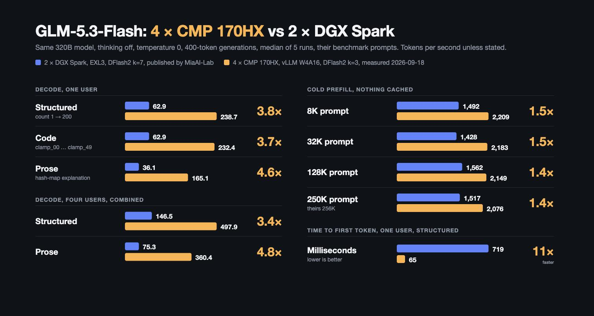

<h1 align="center">GLM-5.3-Flash on 4× NVIDIA CMP 170HX</h1>

<p align="center">
  <strong>by <a href="https://x.com/Morrowmake">Morrowmake</a></strong>
  <br><br>
  <a href="https://x.com/Morrowmake"></a>
  &nbsp;
  <!-- TODO(1.3.0 release): badge, Engine row and the pin in "What runs" move to the merged, validated commit -->
  <a href="https://github.com/Morrowmake/vllm-cmp170hx/tree/ampere-glm53"></a>
  &nbsp;
  
  &nbsp;
  
</p>

**A 320B-parameter MoE with a 262,144-token context, served on four CMP 170HX
cards at PENDING(1.3.0 single-user decode, tok/s, structured / code / prose,
peer-to-peer off) tok/s for one user. The weights are W4A16 and nothing else is
cut: the KV cache is full precision, there is no FP8 anywhere, and nothing is
offloaded to CPU or disk.**

This repository installs and runs **GLM-5.3-Flash** on **four NVIDIA CMP 170HX
cards** behind an OpenAI-compatible API, with tool calls, reasoning, images and
video, and a **DFlash2** speculative drafter. Upstream vLLM's sparse-attention
path needs a Hopper GPU; the CMP 170HX is Ampere (sm_80). Our
[vLLM fork](https://github.com/Morrowmake/vllm-cmp170hx/tree/ampere-glm53) adds
the Ampere kernels that make the model run at all, then spends the rest of its
patches on making it fast and making it repeatable.

One command sets it up and starts it:

```bash
git clone https://github.com/Morrowmake/glm53-flash-cmp170hx-recipe.git
cd glm53-flash-cmp170hx-recipe
./start.sh
```

What changed in this release is in [CHANGELOG.md](CHANGELOG.md).

---

## Results

### Release 1.3.0

Tensor-parallel 4, DFlash2 at k=3, 262,144-token context, the defaults in this
repository. Two columns: the default, with the cards talking through the host,
and the optional [PCIe peer-to-peer](#pcie-peer-to-peer-optional) path.

| | Peer-to-peer off (default) | Peer-to-peer on (optional) |
|---|---:|---:|
| Decode step, 1 / 4 / 6 / 8 users | PENDING(ms/step c1/c4/c6/c8, release pin, P2P off) | PENDING(ms/step c1/c4/c6/c8, release pin, P2P on) |
| Decode, 1 user, structured / code / prose | PENDING(tok/s, P2P off) | PENDING(tok/s, P2P on) |
| Decode, 8 users, aggregate | PENDING(tok/s, P2P off) | PENDING(tok/s, P2P on) |
| Cold prefill | PENDING(tok/s, P2P off) | PENDING(tok/s, P2P on) |
| Time to first token, 6.2K / 23.3K-token prompt | PENDING(TTFT, P2P off) | PENDING(TTFT, P2P on) |
| KV pool at 262,144 context | PENDING(KV tokens and concurrency, P2P off) | PENDING(KV tokens and concurrency, P2P on) |
| Perplexity, fixed 60-document set | PENDING(perplexity, release pin) | PENDING(perplexity, release pin, P2P on) |
| GSM8K, all 1,319 problems | PENDING(GSM8K full, release pin) | PENDING(GSM8K full, release pin, P2P on) |
| HumanEval, pass@1 | PENDING(HumanEval 164, release pin) | PENDING(HumanEval 164, release pin, P2P on) |

### Measured while building this release

These come from development runs on the same four cards. They are not the
release table above; each line says what it was measured against.

- **About a quarter off each decode step.** One user: 20.5 ms per decode step
  with every optional optimisation in the fork switched off, about 15.1 ms with
  the release candidate engine and peer-to-peer on.
- **Second-generation decode kernels**, measured together with peer-to-peer
  on: step time −7.4% at one and four users, −17.6% at six, −5.4% at eight,
  cold prefill flat.
- **The same answer every time.** A request on its own now returns the same
  first token and the same log-probabilities on every repeat, across restarts
  (16 of 16 test prompts, 8 repeats over 2 boots). The fixes cost under 1% of
  step time.
- **More KV for free.** +39,626 KV tokens (+3.45%) from right-sized
  workspaces and a drafter table split across the cards, with outputs
  bit-identical and no step-time cost.
- **Fast does not mean different.** On the previous engine, perplexity with
  every optimisation on and every optimisation off differed by less than
  run-to-run noise.
- **Long context holds up.** On the previous engine: needle retrieval 30/30
  from 8K to 262K tokens, a verbatim copy of a passage at 262,000 tokens
  returned byte-exact, and nothing leaked between concurrent requests.
- **Checked against fp32.** On the release candidate engine, every
  sparse-attention, indexer and key-pool kernel matched an fp32 reference
  exactly or to within bf16/fp8 rounding.

### Against 2× DGX Spark (release 1.0.0)



Measured 2026-09-18 on release 1.0.0 with peer-to-peer off, before most of the
work in this release. Re-run on 1.3.0: PENDING(Spark protocol re-run on the
release pin).

The DGX Spark figures and the benchmark prompts are
[MiaAI-Lab's](https://github.com/MiaAI-Lab/GLM-5.3-Flash-EXL3-2x-DGX-Sparks),
quoted from their README — thank you for publishing both.

- **Theirs:** 2× DGX Spark, EXL3 quant, DFlash2 k=7, 850K–1M declared context, as published.
- **Ours:** 4× CMP 170HX, vLLM W4A16, DFlash2 k=3, 262,144 context, thinking off, temperature 0, median of 5.

**Decode**, 400 max tokens. `Stream` is per request,
`(completion_tokens − 1) / (end − first token)`; `Agg` is
`sum(completion_tokens) / wall` across all streams. Our runs prepend a unique
nonce so nothing hits the prefix cache.

| Prompt type | Users | Theirs stream | Ours stream | Theirs agg | Ours agg | Theirs TTFT | Ours TTFT (cold) |
|---|---:|---:|---:|---:|---:|---:|---:|
| Structured (count 1→200) | ×1 | 62.9 | **238.7** | 62.9 | **238.7** | 719 ms | 65 ms |
|  | ×2 | 51.7 | **185.7** | 103.3 | **348.8** | 6620 ms | 116 ms |
|  | ×4 | 37.1 | **137.5** | 146.5 | **497.9** | 6300 ms | 255 ms |
|  | ×8 | not published | **94.5** | not published | **669.8** | not published | 341 ms |
| Code (clamp_00…clamp_49) | ×1 | 62.9 | **232.4** | 62.9 | **232.4** | 719 ms | 159 ms |
|  | ×2 | 51.7 | **167.0** | 103.3 | **301.5** | 6620 ms | 249 ms |
|  | ×4 | 37.1 | **127.3** | 146.5 | **437.7** | 6300 ms | 399 ms |
|  | ×8 | not published | **87.4** | not published | **603.4** | not published | 624 ms |
| Prose (hash map) | ×1 | 36.1 | **165.1** | 37.1 | **165.1** | 333 ms | 69 ms |
|  | ×2 | 25.0 | **130.5** | 51.1 | **239.6** | 365 ms | 164 ms |
|  | ×4 | 19.4 | **98.3** | 75.3 | **360.4** | 401 ms | 259 ms |
|  | ×8 | not published | **65.5** | not published | **469.7** | not published | 343 ms |

**Cold prefill**, unique uncached text, `max_tokens=1`, median of 2,
`prompt tokens / TTFT` measured client side.

| Rung | Theirs prompt | Theirs TTFT | Theirs tok/s | Ours prompt | Ours TTFT | Ours tok/s |
|---|---:|---:|---:|---:|---:|---:|
| ~8k | 8,221 | 5.51 s | 1492.1 | 7,977 | 3.61 s | **2208.7** |
| ~32k | 32,797 | 22.96 s | 1428.2 | 31,925 | 14.63 s | **2182.9** |
| ~128k | 131,101 | 83.95 s | 1561.7 | 127,587 | 59.36 s | **2149.4** |
| ~250k | 262,173 | 172.84 s | 1516.8 | 250,281 | 120.54 s | **2076.3** |

Their top rung is 262,173 tokens, which does not fit under our 262,144 ceiling,
so our top rung is ~250k. Prose decodes slower than structured or code text on
the same model because the drafter's guesses are accepted less often (0.58–0.63
against 0.91–0.98).

---

## What runs

| | |
|---|---|
| API | OpenAI-compatible, `http://127.0.0.1:8000/v1` |
| Model id | `glm-5.3-flash` |
| Weights | [`canada-quant/GLM-5.3-Flash-W4A16-MTP`](https://huggingface.co/canada-quant/GLM-5.3-Flash-W4A16-MTP) — INT4 weights, FP16 activations, group size 128 |
| Base model | [`zai-org/GLM-5.3-Flash`](https://huggingface.co/zai-org/GLM-5.3-Flash), 320B MoE |
| Drafter | [`incoai/GLM-5.3-Flash-DFlash2`](https://huggingface.co/incoai/GLM-5.3-Flash-DFlash2), 3 draft tokens per step |
| Engine | [Morrowmake/vllm-cmp170hx](https://github.com/Morrowmake/vllm-cmp170hx) `ampere-glm53` @ PENDING(release pin) |
| Layout | tensor-parallel 4 (`TP=4`, `PP=1`); assumes PCIe Gen2 x16 between the cards — see [Link width](#link-width) |
| Context | 262,144 tokens |
| KV cache | full precision, **not quantised**; PENDING(KV pool tokens at 262,144 context, release defaults) |
| Prefill | 3,456-token chunks; long prompts yield to running requests ([fair prefill](#what-makes-it-fast-and-correct)) |
| Prefix caching | on |
| Tools and reasoning | `--enable-auto-tool-choice`, glm47 tool-call and reasoning parsers |
| Vision | images and video on |
| Memory target | `--gpu-memory-utilization 0.95` |

---

## What makes it fast, and correct

All of this is in the fork. The Ampere backends and the correctness fixes are
always on; every performance feature ships off in the engine code and is
switched on by this repository's `serve.sh`, so each one can be turned off with
a single variable (see [Kill switches](#kill-switches)).

- **Ampere sparse attention.** GLM-5.3-Flash uses DeepSeek-style sparse
  attention, whose upstream kernels need Hopper. The fork adds an Ampere
  sparse-MLA backend, an Ampere path for the attention indexer and its FP8
  stores, and Ampere versions of the key-pool compression. Without these the
  model does not run on these cards at all.
- **Fused decode kernels.** The mHC mixing, MoE routing and block alignment,
  and the linear-attention (KDA) decode each run as fused kernels built for the
  small batches decode actually sees. This release adds a second generation:
  the MoE gate, top-k and alignment in one launch, a faster mHC decode, KDA
  decode with its gate projections fused, and the indexer's decode glue folded
  into fewer kernels.
- **Tuned small-batch GEMMs.** W4A16 leaves some layers in BF16, where cuBLAS is
  slow with very few rows. A thin-batch kernel with per-shape tuning covers
  batches up to 32 rows, now including 24-row batches.
- **Retuned sparse-attention decode schedule**, and MoE shared experts that
  genuinely overlap the routed experts instead of finishing before them.
- **Host-staged all-reduce.** Stock CMP 170HX cards refuse GPU peer access, so
  every tensor-parallel collective would take NCCL's slow multi-hop path
  through the host. The fork does each small all-reduce in one round trip
  through shared host memory: −7.7% step time at one user and −15% at four when
  it landed.
- **PCIe peer-to-peer all-reduce, optional.** Where the driver does allow peer
  access, the all-reduce runs in device memory instead — see
  [PCIe peer-to-peer](#pcie-peer-to-peer-optional).
- **Prefill overlap.** During prefill each layer's all-reduces run on a side
  stream while the MoE computes, and it keeps working alongside the
  peer-to-peer path.
- **Fair prefill.** A long prompt no longer starves users who are mid-answer:
  while anyone is decoding, prefill is taken in small slices. Decode speed
  during someone else's long prompt went from 7% to 18% of normal.
- **Bigger prefill chunks.** 3,456-token chunks instead of 1,152: +8.0% cold
  prefill going to 2,304, and +2.4% more going to 3,456.
- **Repeatable output for a single request.** Four sources of run-to-run
  variation are fixed: MoE block alignment in a fixed order, CUDA-graph padding
  rows kept out of the MoE, and the indexer's top-k made consistent on ties and
  returned in a fixed order.
- **A real correctness fix in the key pool.** With speculative decoding, a
  rejected draft could overwrite the tail of the sparse-attention key pool,
  leaving a wrong key in the indexer cache once a conversation passed 2,048
  tokens. The tail is now sized for the draft depth, at no memory cost.
- **KV headroom.** Workspaces sized to what a step can actually use, and the
  drafter's selector tables split across the cards, return memory to the KV
  pool (+39,626 tokens) without changing a single output bit.
- **64-bit KV row offsets** in the sparse-attention kernels, closing a silent
  corruption risk in very large KV pools, and a vocabulary clamp in the sampler
  kernels.

---

## How to use this repo

### What you need

| | |
|---|---|
| GPUs | 4× NVIDIA CMP 170HX, each on a PCIe Gen2 x16 link ([Link width](#link-width)); the preflight wants 60 GiB or more per card |
| OS and driver | Linux with a working NVIDIA driver (`nvidia-smi` lists all four cards) |
| CUDA | a 13.x toolkit at `/usr/local/cuda-13.3`, or set `CUDA_HOME` ([CUDA](#cuda)) |
| Tools | `uv`, `git`, `curl`, Python 3.12, and `jq` for the smoke test |
| Disk | about 185 GB for the two checkpoints |

### Step by step

`./start.sh` on its own does steps 1–3 in order and skips anything already
done, so running it twice is safe. The same steps one at a time:

```bash
./install.sh       # 1. build ./venv and the pinned vLLM fork (about six minutes)
./download.sh      # 2. fetch the model (~178 GB) and the drafter (~2.2 GB) into ./models
./start.sh         # 3. launch in the background, wait for /health, print the KV pool size
./start.sh smoke   # 4. one chat request and one tool call against the running server
./start.sh stop    # stop it; weights and venv stay, so the next start is quick
```

Weight loading and CUDA-graph capture take a few minutes after the download.
`./serve.sh` runs the server in the foreground instead of step 3 if you prefer;
it reads its settings from the environment, not from `.env`.

### Talk to it

```bash
curl http://127.0.0.1:8000/v1/chat/completions \
  -H 'Content-Type: application/json' \
  -d '{"model": "glm-5.3-flash",
       "messages": [{"role": "user", "content": "Write a haiku about PCIe."}],
       "max_tokens": 400}'
```

Any OpenAI-compatible client works with base URL `http://127.0.0.1:8000/v1`
and model `glm-5.3-flash`. The model's reasoning comes back in the `reasoning`
field of the message and the answer in `content`. `reasoning_effort` of `low`,
`high` or `max` sets how much it thinks. Do not send `reasoning_effort: "none"`
or `"chat_template_kwargs": {"enable_thinking": false}`: the model still thinks,
and its reasoning then lands inside `content`.

### Settings

Everything lives in `.env`, copied from [`.env.example`](.env.example) on first
run. A value on the command line beats `.env` for that run:

```bash
MAX_LEN=131072 ./start.sh restart
```

| Key | Default | What it does |
|---|---|---|
| `MAX_LEN` | `262144` | context ceiling; lower it for more concurrent full-length requests |
| `MAX_SEQS` | `8` | concurrent requests |
| `GPU_UTIL` | `0.95` | share of each card's memory the engine may use |
| `SPEC_MODE` / `SPEC_N` | `dflash` / `3` | speculative drafter and draft depth; `mtp` uses the MTP head in the model checkpoint, `none` turns speculation off |
| `VLLM_ALLOW_PCIE_P2P_CUSTOM_ALLREDUCE` | `0` | the [peer-to-peer](#pcie-peer-to-peer-optional) switch |
| `MAX_BATCHED` | `3460` (commented) | sets the prefill chunk: 3,456 tokens; `2048` gives 1,152 |
| `FAIR_PREFILL` / `FAIR_CHUNK` | `1` / `384` | fair prefill and its slice size while others decode |
| `PREFILL_CAP` | `0` | upstream's unconditional chunk cap. **Leave it 0**: it cost 15% prefill here and turns the prefill features off |
| `MM_CAP` | `0` | `1` bounds image and video inputs, which returns roughly 150k KV tokens |
| `PORT` / `SERVED_MODEL_NAME` | `8000` / `glm-5.3-flash` | where and under what name it serves |
| `HF_TOKEN` | unset | a Hugging Face token makes the download faster |

An `.env` copied from an earlier release pins `MAX_BATCHED=2048`; delete that
line to get this release's 3,456-token chunks.

### PCIe peer-to-peer (optional)

**What it is.** The four cards exchange data after every layer. By default that
goes through host memory, because a stock CMP 170HX refuses GPU peer access:
`nvidia-smi topo -p2p r` answers `GNS` on every pair. Where peer access *is*
available, the all-reduce can run card to card in device memory instead, which
is faster.

**The default is off.** With `VLLM_ALLOW_PCIE_P2P_CUSTOM_ALLREDUCE=0` the recipe
needs no driver change of any kind and uses the host-staged path described
above. If you do nothing, this is what you run.

**Who should turn it on.** Only people who already have peer-to-peer working on
their cards. It has to be advertised by the driver. We run a
[cmpunlocker](https://github.com/asm64-hooligan/cmpunlocker) build — that fork
merged onto driver 610.57.04, with official cmpunlocker's `cmp-sku-mask.patch`
added as patch 0010 — installed with `install.sh --p2p`. Read that project's own
documentation; none of it is ours and none of it is in scope here.

It is **topology-dependent**. We verified it on our machine: four cards on
EPYC root ports, all pairs.
[bayley/cmpunlocker](https://github.com/bayley/cmpunlocker) reports the mailbox
path dead behind PLX switches on a Xeon, so a different board may simply not
have it.

**What you gain.** On this release: PENDING(P2P on vs off, ms/step c1/c4/c6/c8,
cold prefill, KV pool, release pin) — the two columns of the
[results table](#release-130). Measured during development on an earlier
engine: −5.8% step time at one user and −10.8% at four, cold prefill unchanged,
and more room for KV.

**Turn it on.**

```bash
nvidia-smi topo -p2p r              # every pair must say OK, not GNS
# then set VLLM_ALLOW_PCIE_P2P_CUSTOM_ALLREDUCE=1 in .env, or for one run:
VLLM_ALLOW_PCIE_P2P_CUSTOM_ALLREDUCE=1 ./start.sh restart
```

`serve.sh` ties the rest to that one variable: it selects the `2stage`
all-reduce kernel (upstream's default crossover is tuned for NVLink) and the
caching-allocator mode the peer-to-peer path needs.

**Check it works.**

```bash
grep "all-reduce backends" logs/serve.log | grep "tp:0"
```

With peer-to-peer on, the list starts with `CUSTOM`: `['CUSTOM', 'PYNCCL']`.
With it off, or if the driver does not actually grant peer access, it reads
`['HOSTSHM', 'PYNCCL']` — the engine falls back to the host-staged path on its
own rather than failing. Then run `./start.sh smoke`.

**Turn it off.** Set `VLLM_ALLOW_PCIE_P2P_CUSTOM_ALLREDUCE=0` in `.env` (or
delete the line) and `./start.sh restart`. That restores the host-staged path
and the default allocator in one step.

### Kill switches

Each feature is one variable. Set it to `0` and restart; no rebuild, no revert:

```bash
VLLM_GLM5_DECODE_KERNELS=0 ./start.sh restart
```

| Variable | Feature |
|---|---|
| `VLLM_GLM5_PREFILL_OVERLAP` | prefill overlap |
| `VLLM_GLM5_PREFILL_KERNELS` | Ampere prefill kernels |
| `VLLM_GLM5_PROLOGUE_FUSE` | fused decode prologue |
| `VLLM_GLM5_LOCAL_LOGITS` | batch-sharded logits and sampling |
| `VLLM_GLM5_DECODE_KERNELS` | fused decode kernels |
| `VLLM_GLM5_DECODE_IDX_GLUE`, `VLLM_GLM5_DECODE_KDA_V2`, `VLLM_GLM5_DECODE_MOE_ROUTE_V2`, `VLLM_GLM5_DECODE_MHC_V2` | second-generation decode kernels |
| `VLLM_GLM5_DRAFTER_ROPE_FIT` | drafter position table sized to the context (more KV) |
| `VLLM_GLM5_THIN_GEMM` | small-batch GEMMs |
| `VLLM_GLM5_HOST_ALLREDUCE` | host-staged all-reduce |
| `VLLM_GLM5_SHARED_EXPERT_REORDER` | shared experts overlapped with the routed experts |
| `FAIR_PREFILL` | fair prefill |

PENDING(release pin: the determinism and KV headroom switches, with their
names and defaults as ported into `serve.sh`).

### Day to day

| Command | |
|---|---|
| `./start.sh` | preflight → install → download → launch → wait for `/health` |
| `./start.sh restart` | stop, then start (picks up `.env` changes) |
| `./start.sh status` | process, `/health`, KV line, install and checkpoint state |
| `./start.sh logs` | follow `logs/serve.log` |
| `./start.sh smoke` | one chat request and one tool call |
| `./start.sh stop` | stop the server this checkout started |
| `./start.sh update` | `git pull`, reinstall if the engine pin moved, restart |
| `VLLM_COMMIT=<older sha> ./start.sh update` | roll back to an earlier engine |
| `DRY=1 ./start.sh` | print the launch command instead of running it |

`stop` only signals the process in `logs/vllm.pid`, after confirming it is the
server this checkout launched; it never searches by process name, so another
vLLM on the same machine is never touched.

The engine pin lives in `start.sh`, so a `git pull` can move it, and `start.sh`
reinstalls whenever it changes: the compiled extensions must match the upstream
commit the fork sits on. Uncomment `VLLM_COMMIT` in `.env` to freeze it.

### CUDA

You need a 13.x toolkit. NVIDIA had no working `ubuntu2604` repository index
when we built this, so we used the `ubuntu2404` one:

```bash
wget https://developer.download.nvidia.com/compute/cuda/repos/ubuntu2404/x86_64/cuda-keyring_1.1-1_all.deb
sudo dpkg -i cuda-keyring_1.1-1_all.deb
sudo apt-get update
sudo apt-get install -y cuda-toolkit-13-3 git-lfs
```

The install uses upstream's **precompiled** CUDA extensions, which is why it
takes minutes: the fork's patches are Python, Triton and TileLang and touch no
CUDA or C++ source, so the compiled objects are the same, and upstream's
already carry sm_80 code. To compile them yourself:
`BUILD_FROM_SOURCE=1 MAX_JOBS=16 ./install.sh` (full toolkit, ~60 GB of
scratch, one to two hours).

### Link width

Tensor parallelism moves about 9.4 MB per layer between the cards during
prefill and roughly 100 small collectives per decode step. It assumes PCIe Gen2
x16 links; on x4 links it is bus-bound and far slower than the numbers above.
`./start.sh` prints each card's link width in its preflight and warns if any is
narrower than x16. For narrower links, see the [roadmap](#status-and-roadmap).

<!-- TODO(1.3.0 release): replace the sample below with ./start.sh smoke output from the release pin and defaults. -->
**Smoke test output** looks like this (sample from an earlier release):

```
==> waiting for http://127.0.0.1:8000/health (up to 900s)
    healthy
    served models: glm-5.3-flash
==> chat request
    usage: prompt=28 completion=200 wall=1.41s  ->  142.2 tok/s
==> tool-call request
    tool_call: get_weather({"city": "Reykjavik"})
    usage: prompt=199 completion=40 wall=0.37s  ->  109 tok/s
==> KV cache
    GPU KV cache size: 1,160,192 tokens, Maximum concurrency for 262,144 tokens per request: 4.43x
```

---

## Status and roadmap

- **Tensor-parallel 4 is the supported layout in 1.3.0.** It gives each request
  the fastest answer and suits one or two interactive users or agents.
- **Pipeline-parallel 4 is in active development** for systems without the x16
  capacitor modification, whose cards run on narrower PCIe links. Each card
  holds a quarter of the layers and passes only activations to the next, so it
  needs far less link bandwidth and leaves more memory for KV. It is aimed at
  many parallel agents and long prompts, and it comes in a later release with
  its own validation and numbers. Until then, another pipeline-parallel recipe
  for these cards is
  [JJ48/glm53-flash-170hx-serving](https://github.com/JJ48/glm53-flash-170hx-serving).
- **Optimisation continues** on both layouts; every change ships with a kill
  switch and measured numbers.

---

## Known limits

- **Ampere only.** Every kernel in the fork is written for sm_80. On newer GPUs
  upstream vLLM's own kernels are better, and forcing these features on
  elsewhere is untested.
- **Wide links for tensor-parallel.** See [Link width](#link-width).
- **Repeatable per request, not per batch.** A request on its own gives the
  same result every time. When requests share a batch, the result can differ
  slightly from the same request alone, by about as much as with every
  optimisation switched off.
- **Context and KV are a trade.** Raising `MAX_LEN` lowers how many full-length
  requests fit at once. With `MM_CAP=0` (the default) the memory profiler also
  reserves room for a context-filling video, roughly 150k KV tokens.
- **The DFlash2 checkpoint is needed for the default mode.** `SPEC_MODE=mtp`
  uses the MTP head inside the model checkpoint, and `none` turns speculation
  off; both are slower.
- **Host-staged all-reduce is only for cards without peer access.** Where
  peer-to-peer works, it stands aside for the device-memory path.

---

## Licence

**This recipe** — the scripts and the documentation — is MIT, © 2026 Morrowmake.
See [LICENSE](LICENSE).

**The vLLM fork** it installs is Apache-2.0, like upstream vLLM; our patches are
contributed under that licence.

**The weights** are MIT: the quantisation
[`canada-quant/GLM-5.3-Flash-W4A16-MTP`](https://huggingface.co/canada-quant/GLM-5.3-Flash-W4A16-MTP)
and the base model
[`zai-org/GLM-5.3-Flash`](https://huggingface.co/zai-org/GLM-5.3-Flash).

**The DFlash2 drafter**
([`incoai/GLM-5.3-Flash-DFlash2`](https://huggingface.co/incoai/GLM-5.3-Flash-DFlash2))
is **CC BY-NC-ND 4.0** — research and evaluation only, non-commercial, no
derivatives. It is the default speculator here, so read that before you deploy
this anywhere commercial. `SPEC_MODE=mtp` serves the MTP head inside the MIT
model checkpoint instead and does not use it at all.

**The benchmark prompts and the published DGX Spark figures** are quoted from
MiaAI-Lab's repository (AGPL-3.0) and their sparkDash prompt constants (MIT),
used as data with attribution. No code from their repositories is included here.

## Credits

- **[MiaAI-Lab](https://github.com/MiaAI-Lab/GLM-5.3-Flash-EXL3-2x-DGX-Sparks)**
  for publishing their 2× DGX Spark figures and their benchmark prompts, which
  are the entire comparison column above.
- **[incoai](https://huggingface.co/incoai/GLM-5.3-Flash-DFlash2)** for the
  DFlash2 drafter checkpoint.
- **[canada-quant](https://huggingface.co/canada-quant/GLM-5.3-Flash-W4A16-MTP)**
  for the W4A16 quantisation.
- **[Z.ai](https://huggingface.co/zai-org/GLM-5.3-Flash)** for GLM-5.3-Flash,
  and the **[vLLM](https://github.com/vllm-project/vllm)** project for the
  engine these patches sit on top of.

## Source

The patches are ours; the fork branch is the code —
[Morrowmake/vllm-cmp170hx @ `ampere-glm53`](https://github.com/Morrowmake/vllm-cmp170hx/tree/ampere-glm53).
